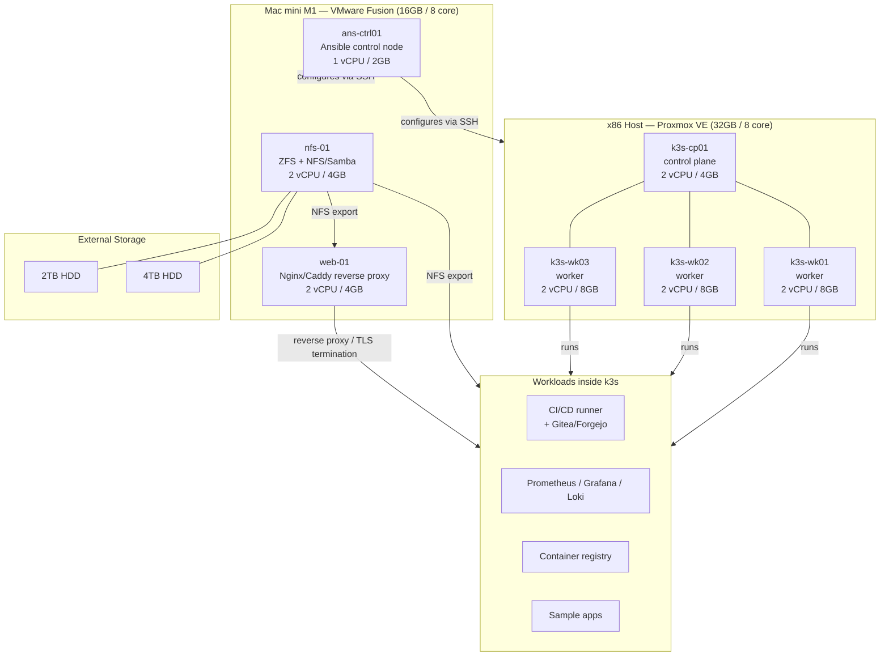

# Homelab Platform — Design Document

**Status:** Draft
**Author:** [Your Name]
**Last updated:** 2026-09-11

## 1. Overview

This document defines the requirements, architecture, and phased build plan for a
two-host homelab platform used both as a personal infrastructure environment and
as a portfolio piece demonstrating IaC, container orchestration, configuration
management, and systems administration skills.

The platform runs across two physical hosts:

- **x86 host** — 32 GB RAM, 8 cores, 1 TB SSD, running Proxmox VE
- **Apple M1 host (Mac mini)** — 16 GB RAM, 8 cores, 512 GB storage, running
  macOS + VMware Fusion, plus 2 TB and 4 TB external HDDs for bulk storage

## 2. Goals

- G1: Stand up a real multi-node k3s cluster demonstrating container
  orchestration, self-healing, and rolling deployments.
- G2: Demonstrate Infrastructure-as-Code practices (Terraform for provisioning,
  Ansible for configuration) across a heterogeneous (x86 + ARM) environment.
- G3: Provide a functioning storage and web-serving tier independent of the
  cluster, backed by ZFS/NFS.
- G4: Produce a CI/CD pipeline that builds and deploys workloads into the
  cluster automatically.
- G5: Provide observability (metrics, logs, alerting) across the platform.
- G6: Document the platform well enough that a reader unfamiliar with it can
  understand the architecture and the reasoning behind each decision.

## 3. Non-Goals (deferred / out of scope for v1)

- NG1: Centralized identity management (FreeIPA) — deferred to a future phase.
- NG2: Dedicated firewall/router VM (pfSense/OPNsense) and VLAN segmentation —
  deferred; existing home router used for now.
- NG3: Public internet exposure of any service. All access is local-network or
  VPN-gated only.
- NG4: High availability / multi-control-plane k3s — single control-plane node
  is acceptable for v1 given hardware constraints.

## 4. Requirements

### 4.1 Functional Requirements

| ID | Requirement |
|----|-------------|
| FR1 | The platform SHALL run a k3s cluster with 1 control-plane node and 3 worker nodes on the x86 host. |
| FR2 | The platform SHALL provide a reverse-proxy/web-serving tier on the M1 host, independent of the k3s cluster. |
| FR3 | The platform SHALL provide shared storage (NFS, backed by ZFS) accessible to both hosts. |
| FR4 | The platform SHALL use Ansible, run from a dedicated control node, to configure all VMs. |
| FR5 | The platform SHALL use Terraform to provision VMs on Proxmox. |
| FR6 | The platform SHALL provide a CI/CD pipeline that builds container images and deploys them to k3s on commit. |
| FR7 | The platform SHALL expose metrics, logs, and dashboards for all major components. |
| FR8 | All inter-service traffic and any exposed web service SHALL be served over TLS with a real, trusted certificate obtained via DNS-01 challenge. |

### 4.2 Non-Functional Requirements

| ID | Requirement |
|----|-------------|
| NFR1 | **Reliability** — a single VM or pod failure should not take down the whole platform; k3s should reschedule failed workloads automatically. |
| NFR2 | **Security** — no service is reachable from the public internet; remote access is via VPN only. |
| NFR3 | **Reproducibility** — any VM should be rebuildable from Terraform + Ansible with minimal manual steps. |
| NFR4 | **Resource efficiency** — host RAM/CPU allocation should leave adequate headroom for the hypervisor/OS (see §6). |
| NFR5 | **Documentation** — every major architectural decision is recorded (see ADRs, §8) so the reasoning is auditable later. |

## 5. Architecture

## 6. Resource Allocation

### x86 host (32GB total — ~4GB reserved for Proxmox)

| VM | Role | vCPU | RAM | Disk |
|----|------|------|-----|------|
| k3s-cp01 | k3s control plane | 2 | 4GB | 40GB |
| k3s-wk01 | k3s worker | 2 | 8GB | 60GB |
| k3s-wk02 | k3s worker | 2 | 8GB | 60GB |
| k3s-wk03 | k3s worker | 2 | 8GB | 60GB |

### M1 host (16GB total — ~6GB reserved for macOS + Fusion)

| VM | Role | vCPU | RAM | Disk |
|----|------|------|-----|------|
| ans-ctrl01 | Ansible control node | 1 | 2GB | 20GB |
| nfs-01 | ZFS pool + NFS/Samba export | 2 | 4GB | 20GB OS + HDD passthrough |
| web-01 | Nginx/Caddy reverse proxy | 2 | 4GB | 20GB |

## 7. Technology Choices Summary

| Area | Choice | Alternative(s) considered |
|------|--------|---------------------------|
| Hypervisor (x86) | Proxmox VE | ESXi, bare KVM |
| Hypervisor (M1) | VMware Fusion | UTM, Asahi Linux + KVM |
| Guest OS | RHEL 10 (aarch64 + x86_64) | Rocky Linux, AlmaLinux |
| Orchestration | k3s | full k8s (kubeadm), Nomad |
| Config management | Ansible | Puppet, Chef, SaltStack |
| Provisioning | Terraform (Proxmox provider) | manual VM creation, Packer |
| Storage | ZFS + NFS | TrueNAS Scale appliance |
| Reverse proxy | Nginx or Caddy | Traefik |
| TLS | Let's Encrypt via DNS-01 | Internal CA (step-ca) — may add later |
| Identity | Deferred (NG1) | FreeIPA (future phase) |

## 8. Key Decisions (ADR summary)

- **ADR-001: k3s over full Kubernetes.** Lower resource overhead fits the
  hardware budget; still demonstrates the same core orchestration concepts.
- **ADR-002: VMware Fusion over UTM on the M1.** Better performance via
  Apple's native Hypervisor.framework; confirmed working with RHEL 10 aarch64.
- **ADR-003: FreeIPA and pfSense deferred.** FreeIPA server has poor ARM
  packaging support and pfSense requires dedicated NIC passthrough neither
  host can spare in v1; both are cleanly separable future additions.
- **ADR-004: CI/CD, Gitea, and observability run as k3s workloads, not
  dedicated VMs.** Avoids VM sprawl and better demonstrates Kubernetes'
  resource bin-packing value proposition.

## 9. Implementation Phases

1. **Phase 1 — Provisioning:** Terraform + Proxmox provider brings up all 7 VMs
   from a template.
2. **Phase 2 — Configuration:** Ansible roles harden and configure all hosts
   (users, SSH keys, baseline packages).
3. **Phase 3 — Cluster bootstrap:** k3s installed across the 4 x86 VMs.
4. **Phase 4 — Storage & web tier:** ZFS pool + NFS exports on nfs-01; Nginx/Caddy
   on web-01 with Let's Encrypt DNS-01 TLS.
5. **Phase 5 — CI/CD:** Gitea + runner deployed into k3s; build/push/deploy
   pipeline for a sample app.
6. **Phase 6 — Observability:** Prometheus/Grafana/Loki deployed into k3s.
7. **Phase 7 (future) — FreeIPA and/or pfSense**, if revisited.

## 10. Open Questions

- Should TLS use DNS-01 with a real domain for all internal services, or mix
  in an internal CA (step-ca) for purely internal hostnames?
- Will persistent volumes for k3s be backed by the M1's NFS export, or will
  each worker use local storage for stateful workloads?
