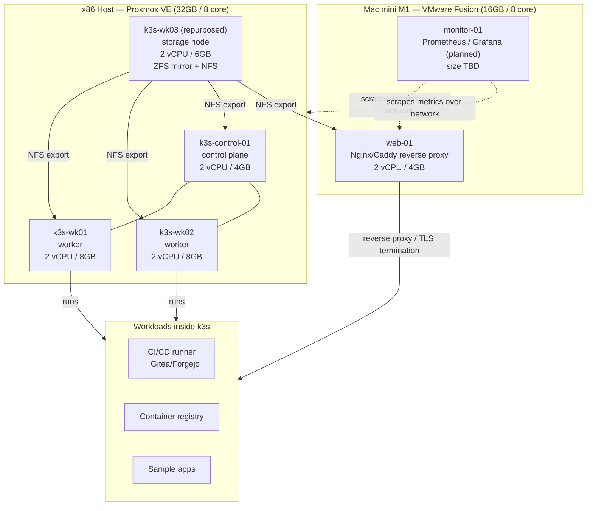

# Homelab Platform — Design Document

**Status:** Draft
**Author:** Adrian Hernandez

## Progress Notes

- RHEL 10.2 template built, generalized, and converted to a Proxmox template.
- 4 VMs originally provisioned via Terraform on the x86 host. Control plane renamed
  `k3s-cp01` → `k3s-control-01`.
- One worker (`k3s-wk03`) was drained, removed from the k3s cluster, and repurposed as
  a dedicated storage node rather than staying a k3s worker — see ADR-005. It is
  tracked in Terraform as `storage_identity_01` (imported, not cloned) but has not yet
  been renamed at the OS/hostname level — it still reports as `k3s-wk03`. This is a
  known open item.
- The k3s cluster now runs 3 nodes: 1 control plane (`k3s-control-01`), 2 workers
  (`k3s-wk01`, `k3s-wk02`).
- Ansible baseline playbook covers hostnames, package updates, firewalld rules for
  k3s ports, and Red Hat subscription registration (credentials in Ansible Vault).
- k3s installed and joined across all cluster nodes. Verified live with `kubectl get nodes`.
- Fixed a RHEL 10 compatibility issue where `subscription-manager attach` no longer
  exists (Simple Content Access made it obsolete). Replaced with a direct, idempotent
  `command` task with its own status check.
- Fixed kubectl access for the non-root user by copying the kubeconfig and setting
  `$KUBECONFIG`, since k3s's bundled kubectl doesn't follow the standard config lookup path.
- On the M1 host: ZFS and Btrfs were both found to be unavailable for RHEL 10 on
  aarch64 (see ADR-005). Storage was moved to the x86 host instead. The M1's original
  `nfs-01` VM was renamed `monitor-01` and is now planned for Prometheus/Grafana
  instead — see ADR-007.
- On the x86 storage node: two external USB drives (2TB, 4TB) were relocated from the
  M1 to the x86 Proxmox host, passed through to the VM as raw block devices, and
  combined into a mirrored ZFS pool (`tank`, ~1.8TB usable — see ADR-006). A dataset
  (`tank/shared`) was created and exported over NFS.
- The NFS export is mounted persistently (via Ansible, `/etc/fstab`-backed) on all 3
  k3s nodes and on `web-01`, confirmed to survive reboot. Mount and write access
  verified across both x86 and ARM clients.
- No application workloads deployed to the cluster yet. Reverse proxy on `web-01` and
  monitoring on `monitor-01` not yet configured.

## 1. Overview

This document defines the requirements, architecture, and phased build plan for a
two-host homelab platform used both as a personal infrastructure environment and
as a portfolio piece demonstrating IaC, container orchestration, configuration
management, and systems administration skills.

The platform runs across two physical hosts:

- **x86 host** — 32 GB RAM, 8 cores, 1 TB SSD, running Proxmox VE
- **Apple M1 host (Mac mini)** — 16 GB RAM, 8 cores, 256 GB storage, running
  macOS + VMware Fusion

## 2. Goals

- G1: Stand up a real multi-node k3s cluster demonstrating container
  orchestration, self-healing, and rolling deployments.
- G2: Demonstrate Infrastructure-as-Code practices (Terraform for provisioning,
  Ansible for configuration) across a heterogeneous (x86 + ARM) environment.
- G3: Provide functioning, redundant, cross-architecture shared storage backed by
  ZFS and exported over NFS.
- G4: Produce a CI/CD pipeline that builds and deploys workloads into the
  cluster automatically.
- G5: Provide observability (metrics, logs, alerting) across the platform.
- G6: Document the platform well enough that a reader unfamiliar with it can
  understand the architecture and the reasoning behind each decision, including
  where the plan changed and why.

## 3. Non-Goals (deferred / out of scope for v1)

- NG1: Centralized identity management (FreeIPA). Deferred to a future phase.
- NG2: Dedicated firewall/router VM (pfSense/OPNsense) and VLAN segmentation.
  Deferred. Existing home router used for now.
- NG3: Public internet exposure of any service. All access is local-network or
  VPN-gated only.
- NG4: High availability / multi-control-plane k3s. A single control-plane node
  is acceptable for v1 given hardware constraints.
- NG5: Multi-architecture k3s cluster. Considered and deliberately rejected —
  see ADR-007. The cluster stays entirely on x86.

## 4. Requirements

### 4.1 Functional Requirements

| ID | Requirement |
|----|-------------|
| FR1 | The platform SHALL run a k3s cluster with 1 control-plane node and 2 worker nodes on the x86 host. |
| FR2 | The platform SHALL provide a reverse-proxy/web-serving tier on the M1 host, independent of the k3s cluster. |
| FR3 | The platform SHALL provide shared storage (NFS, backed by a mirrored ZFS pool) accessible to both hosts, mounted persistently. |
| FR4 | The platform SHALL use Ansible, run from the operator's own machine, to configure all VMs. |
| FR5 | The platform SHALL use Terraform to provision VMs on Proxmox. |
| FR6 | The platform SHALL provide a CI/CD pipeline that builds container images and deploys them to k3s on commit. |
| FR7 | The platform SHALL expose metrics, logs, and dashboards for all major components via a dedicated monitoring node. |
| FR8 | All inter-service traffic and any exposed web service SHALL be served over TLS with a real, trusted certificate obtained via DNS-01 challenge. |

### 4.2 Non-Functional Requirements

| ID | Requirement |
|----|-------------|
| NFR1 | **Reliability** — a single VM or pod failure should not take down the whole platform. k3s should reschedule failed workloads automatically. Storage should tolerate a single disk failure. |
| NFR2 | **Security** — no service is reachable from the public internet. Remote access is via VPN only. |
| NFR3 | **Reproducibility** — any VM should be rebuildable from Terraform and Ansible with minimal manual steps. |
| NFR4 | **Resource efficiency** — host RAM/CPU allocation should leave adequate headroom for the hypervisor/OS (see §6). |
| NFR5 | **Documentation** — every major architectural decision is recorded (see ADRs, §8), including decisions that reversed or changed the original plan. |

## 5. Architecture

## 6. Resource Allocation

### x86 host (32GB total, ~4GB reserved for Proxmox)

| VM | Role | vCPU | RAM | Disk |
|----|------|------|-----|------|
| k3s-control-01 | k3s control plane | 2 | 4GB | 40GB |
| k3s-wk01 | k3s worker | 2 | 8GB | 60GB |
| k3s-wk02 | k3s worker | 2 | 8GB | 60GB |
| k3s-wk03 (repurposed) | storage node — ZFS mirror + NFS | 2 | 6GB | 30GB OS + 2 raw passthrough disks (2TB, 4TB) |

### M1 host (16GB total, ~5-6GB reserved for macOS + Fusion)

| VM | Role | vCPU | RAM |
|----|------|------|-----|
| web-01 | Nginx/Caddy reverse proxy | 2 | 4GB |
| monitor-01 | Prometheus / Grafana (planned) | TBD | TBD |

## 7. Technology Choices Summary

| Area | Choice | Alternative(s) considered |
|------|--------|---------------------------|
| Hypervisor (x86) | Proxmox VE | ESXi, bare KVM |
| Hypervisor (M1) | VMware Fusion | UTM, Asahi Linux + KVM |
| Guest OS | RHEL 10 (aarch64 + x86_64) | Rocky Linux, AlmaLinux |
| Orchestration | k3s, x86 only | full k8s (kubeadm), Nomad, multi-arch cluster |
| Config management | Ansible | Puppet, Chef, SaltStack |
| Provisioning | Terraform (Proxmox provider) | manual VM creation, Packer |
| Storage | Mirrored ZFS + NFS, on x86 | ZFS on ARM (unavailable), Btrfs (unavailable in RHEL), mdadm+LVM+XFS |
| Reverse proxy | Nginx or Caddy | Traefik |
| Monitoring | Prometheus + Grafana, on a dedicated M1 node | in-cluster monitoring stack |
| TLS | Let's Encrypt via DNS-01 | Internal CA (step-ca), may add later |
| Identity | Deferred (NG1) | FreeIPA (future phase) |

## 8. Key Decisions (ADR summary)

- **ADR-001: k3s over full Kubernetes.** Lower resource overhead fits the
  hardware budget. Still demonstrates the same core orchestration concepts.
- **ADR-002: VMware Fusion over UTM on the M1.** Expected to run RHEL 10
  aarch64 based on available community reports at planning time. Since
  confirmed by actually building on it.
- **ADR-003: FreeIPA and pfSense deferred.** FreeIPA server has poor ARM
  packaging support, and pfSense requires dedicated NIC passthrough neither
  host can spare in v1. Both are cleanly separable future additions.
- **ADR-004: CI/CD and the container registry run as k3s workloads, not
  dedicated VMs.** Avoids VM sprawl and better demonstrates Kubernetes'
  resource bin-packing value proposition.
- **ADR-005: Storage moved from the M1 to the x86 host.** ZFS has no aarch64
  builds for RHEL 10 (confirmed: 404 on OpenZFS's own aarch64 EL10 repo path).
  Btrfs was also considered and rejected — Red Hat has never supported it in
  RHEL 8/9/10. Rather than build storage on ARM with a lesser filesystem
  (mdadm+LVM+XFS), storage was moved to the x86 host, where ZFS has full,
  mature support. This required draining and removing a k3s worker
  (`k3s-wk03`) from the cluster, importing it into Terraform under a new
  resource name, and physically relocating the external drives from the M1 to
  the x86 machine.
- **ADR-006: Mirrored ZFS pool despite mismatched disk sizes.** The two
  available drives are 2TB and 4TB. A mirror only uses as much of the larger
  disk as matches the smaller one, yielding ~1.8TB usable instead of the ~6TB
  a striped pool would give. Redundancy was prioritized over capacity, since
  the storage tier is intended to eventually hold real data.
- **ADR-007: The M1's freed VM (`nfs-01` → `monitor-01`) hosts Prometheus and
  Grafana instead of joining an ARM node to the k3s cluster.** A mixed-arch
  cluster was considered, but adds real operational complexity (multi-arch
  images, node affinity) for a machine that isn't a dedicated always-on
  server. Monitoring is a better fit: Prometheus scrapes targets over the
  network regardless of architecture, so a monitoring node deliberately
  sitting outside the infrastructure it watches — on different hardware
  entirely — is a legitimate, common pattern, not a compromise.

## 9. Implementation Phases

1. **Phase 1 — Provisioning:** Terraform + Proxmox provider brings up the x86 VMs
   from a template.
2. **Phase 2 — Configuration:** Ansible roles harden and configure all hosts
   (users, SSH keys, baseline packages).
3. **Phase 3 — Cluster bootstrap:** k3s installed across the x86 cluster nodes.
4. **Phase 4 — Storage:** Worker repurposed to a storage node. ZFS mirror + NFS
   export built, mounted persistently across the cluster and `web-01`. *(Complete)*
5. **Phase 5 — Web tier:** Nginx/Caddy configured on `web-01` with Let's Encrypt
   DNS-01 TLS. *(Not started)*
6. **Phase 6 — Monitoring:** Prometheus/Grafana deployed on `monitor-01`.
   *(Not started)*
7. **Phase 7 — CI/CD:** Gitea + runner deployed into k3s. Build/push/deploy
   pipeline for a sample app. *(Not started)*
9. **Phase 8 FreeIPA**, if revisited.